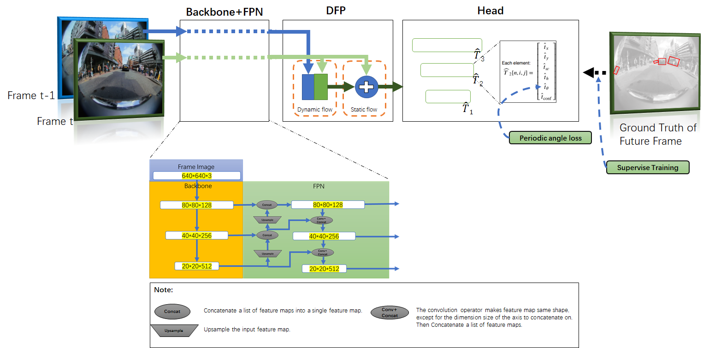
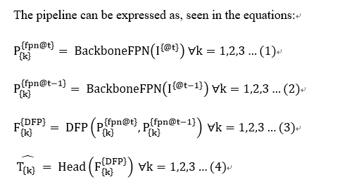
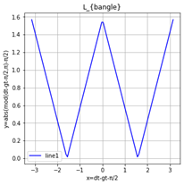
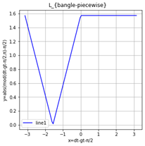
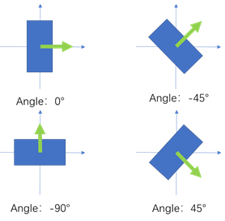
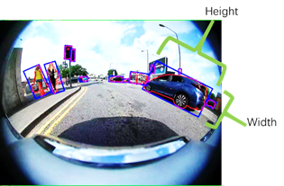

@[toc]

# Code

https://gitee.com/hiyanyx/fisheye-streaming-perception


# Introuduce

Fisheye cameras are widely employed in automatic parking, and the video stream object detection (VSOD) of the fisheye camera is a fundamental perception function to ensure the safe operation of vehicles. In past research work, the difference between the output of the deep learning model and the actual situation at the current moment due to the existence of delay of the perception system is generally ignored. But the environment will inevitably change within the delay time which may cause a potential safety hazard. In this paper, we propose a real-time detection framework equipped with a dual-flow perception module (dynamic and static flows) which can predict the future and alleviate the time-lag problem. Meanwhile we use a new scheme to evaluate latency and accuracy. The standard bounding box is unsuitable for the object in fisheye camera images due to the strong radial distortion of the fisheye camera and the primary detection objects of parking perception are vehicles and pedestrians, so we adopt the rotate bounding box and propose a new periodic angle loss function to regress the angle of box, which is the simple and accurate representation method of objects. The instance segmentation ground truth is used to supervise the training. Experiments demonstrate the effectiveness of our approach. Code is released at: https://gitee.com/hiyanyx/fisheye-streaming-perception.





The model follows the paradigm of a one-stage detector, including a backbone, a feature pyramid network (FPN), a dual-flow perception module, and a detector head. The detector head is a rotated bounding box regression. The model structure is shown in Figure 1, where arrows represent multiple convolution layers, and the color rectangles represent feature maps, whose size corresponds to the size of h × w = 640 × 640.
The pipeline can be expressed as, seen in the equations:




# 1.Models

We designed a total of 4 sets of models, and used the triplet (Ft, Ft-1, Gt) dataset or the triplet (Ft, Ft-1, Gt+1) dataset for training and evaluation. By controlling variables, the designed models are as follows:
- Model 0-BASE: CSPDarknet backbone and FPN used in YOLOX-s, no DFP module, L_{bangle-normal}  function of L1 norm. 
- Model 1: CSPDarknet backbone and FPN used in YOLOX-s, no DFP module, L_{bangle}  function of L1 norm. 
- Model 2: CSPDarknet backbone and FPN used in YOLOX-s, no DFP module, L_{bangle-piecewise}  function of L1 norm. 
- Model 3: CSPDarknet backbone and FPN used in YOLOX-s, DFP module, L_{bangle} function of L1 norm.


## L_{bangle}  function of L1 norm




Figure 4. L_{bangle}  L1 norm form. “dt” is ({bangle} ) ̂. “gt” is {bangle}. The abscissa is x=dt-gt-π/2 and the ordinate is y=abs(mod(dt-gt-π/2,π)-π/2). The curve visualizes the loss function of L_{bangle} .

##  L_{bangle-piecewise}  function of L1 norm



Figure 6. L_{bangle-piecewise}  L1 norm form. “dt” is ({bangle} ) ̂. “gt” is {bangle}. The abscissa is x=dt-gt-π/2 and the ordinate is a piecewise function. The curve visualizes the loss function of L_{bangle-piecewise} 


## Annotation of the dataset

In order to ensure that the training of the network model can converge, we need to ensure that the label information of the rotated bounding box cannot be ambiguous. Therefore, we set the rule that the shorter side of the rotated bounding box is the width and the longer side is the length, this is, {bw}<{bh}. In this case, the angle range [- π/2,π/2) of the rotated bounding box can unambiguously represent the whole situation. So we modify the annotation of the dataset, force the bounding box to bw<bh, and make the angle range to [- π/2,π/2) . As shown in Figure 5.



Figure 5. The angle range of the rotation bounding box is [-90,90), which can describe the whole situation of any rotation of the bounding box.



Figure 7. The red outline points are the original labeling information of WoodScape and the blue bounding box is the bounding box we generate. The shorter side of the rotated bounding box is the width and the longer side is the length, this is, {bw}<{bh}.


## weight download
- Model 0-BASE: fisheyeSPModels/weights/normalL1_NoFuture640_Jan04_WoodScape/M3DarkFP_normalL1_NoFuture640_Jan04_10000.ckpt
  - https://gitee.com/hiyanyx/fisheye-streaming-perception/releases/download/v1.0/(Model0-BASE)normalL1_NoFuture640_Jan04_WoodScape.rar
- Model 1:fisheyeSPModels/weights/rapid_pL1_DarkFP_Future_Dec29_Argoverse/M3DarkFP_rapid_pL1_Future640_Dec30_30000.ckpt 
  - https://gitee.com/hiyanyx/fisheye-streaming-perception/releases/download/v1.0/(Model1)rapid_pL1_DarkFP_Future_Dec29_Argoverse.rar
- Model 2:fisheyeSPModels/weights/M3DarkFP_rapid_pL1_piecewise_NoFuture640_Jan06-woodscape/M3DarkFP_rapid_pL1_piecewise_NoFuture640_Jan06_10000.ckpt
  - https://gitee.com/hiyanyx/fisheye-streaming-perception/releases/download/v1.0/(Model2)DarkFP_rapid_pL1_piecewise_NoFuture640_Jan06-woodscape.rar
- Model 3:fisheyeSPModels/weights/rapid_pL1_dark53DSSP_Future_Dec27_Argoverse/M3rapid_pL1_dark53DSSP_Future640_Dec27_30000.ckpt  
  - https://gitee.com/hiyanyx/fisheye-streaming-perception/releases/download/v1.0/(Model3)rapid_pL1_dark53DSSP_Future_Dec27_Argoverse.rar


## 1.1Implementation Details
The experimental pre-training weights were obtained from COCO pre-trained model by 15 epochs.

WoodScape dataset is a fisheye dataset, which is in RGB format, with a resolution of 1MPx and a horizontal FOV of 190 °. Using the Front/ Rear / Mirror Left/ Mirror Right cameras and the corresponding annotation, there are a total of 7,000 pictures in the training dataset and 1,200 pictures in the verification dataset. The assigned training and verification annotation information is available on our gitee warehouse:``fisheye-streaming-perception/fisheyeSPModels/WoodScape-HD-Full /WoodScape-HD-Full /WoodScape-HD /annotations/val.json``

For the WoodScape dataset, training network after 10,000 iterations (one iteration contains 128 images). The anchor configuration data is used as: anchors1 = [24, 45], [28, 24], [50, 77]; anchors2 = [52, 39], [92, 145], [101, 69]; anchors3 = [52, 39], [92, 145], [101, 69].

Argoverse-HD is a video stream object dataset, which can be used to evaluate the performance of high frame rate object detection and calculate the sAP performance indicators. Use only the central RGB camera and the corresponding annotation. The training dataset has a total of 65 pieces of data, each piece of data has 900 pictures. The verification collection has a total of 24 pieces of data, each piece of data has 900 pictures. The assigned training and verification annotation information is available on our gitee warehouse:``fisheye-streaming-perception /fisheyeSPModels /Argoverse-HD-Full /Argoverse-HD /annotations/val.json``

For the Argoverse-HD dataset, training network after 30,000 iterations (one iteration contains 128 images). The anchor configuration data is used as: anchors1 = [18, 33], [28, 61], [48, 68]; anchors2 = [45, 101], [63, 113], [81, 134]; anchors3 = [91, 144], [137, 178], [194, 250].The 

Use Stochastic Gradient Descent (SGD) for training. The learning rate is 0.001, batch size is 24, momentum is 0.9, and weight decay is 0.0005. Rotation, flipping, resizing, and color enhancement is not applicable. For inference, we keep the input size at 640× 640, run on GTX 3090ti GPU. 

## 1.2 Benchmark Model Details
For comparative experiments, we chose the FisheyeYOLO[14] model trained on the WoodScape [33] dataset as the benchmark model. 
The backbone network of the benchmark model is ResNet18 [37], and the detection head outputs a standard bounding box. The open source model and weights provided by FisheyeYOLO do not provide the predicted value of the angle of the bounding box. We have no additional fine-tuning training. 
The bounding box has a total of four values [x_min,y_min,x_max,y_max], which are the upper left and lower right points of the target in the picture. The picture size of the input model is 640×640.

Although this benchmark comparison has some flaws, because the backbone networks used are inconsistent, it still shows the mainstream detection level of the current standard bounding box on the fisheye picture. By comparing with the benchmark model, it can also be shown that the solution we proposed has a significant performance improvement.
## Benchmark weight download
- /fisheyeSPModels/weights/WoodScapeoffical/encoder.pth 
  - https://gitee.com/hiyanyx/fisheye-streaming-perception/releases/download/v1.0/(BenchmarkModel)Encoder.rar
-  /fisheyeSPModels/weights/WoodScapeoffical/detection.pth
  - https://gitee.com/hiyanyx/fisheye-streaming-perception/releases/download/v1.0/(BenchmarkModel)Decoder.rar


# 2 Result
{bconf}>0.01 ,nms=0.45, and IoU_threshold=0.5 and 0.75 , calculate the values of TP, FP, and FN, Precision, Recall, F1, AP0.5, and AP0.75 , as well as AP-mean values. 

## 2.1 on WoodScape
### 2.1.1 Benchmark Model
Average Precision (AP) @[ IoU=0.5:0.95  | area=   all | maxDets=100 ] = 0.080                                           
Average Precision (AP) @[ IoU=0.5       | area=   all | maxDets=100 ] = 0.295                                           
Average Precision (AP) @[ IoU=0.75      | area=   all | maxDets=100 ] = 0.011                                           
AP for IoU=0.5, 0.55, 0.6, ..., 0.95: [0.295, 0.229, 0.15, 0.075, 0.034, 0.011, 0.004, 0.001, 0.0, 0.0]                 
Best confidence thresholds: tensor([0.4379, 0.7511, 0.7784, 1.0000, 1.0000, 1.0000, 1.0000, 1.0000, 1.0000,                    1.0000])
[IoU=0.5] TP=2152.0, FP=3161.0, FN=3311.0, Precision=0.40504422783851624, Recall=0.39392274618148804, F1=0.3994060754776001, 
[IoU=0.75] TP=312.0, FP=5001.0, FN=5151.0, Precision=0.05872388556599617, Recall=0.0571114756166935, F1=0.057906460016965866  

### 2.1.2 Model 0-BASE
/mnt/e/fisheye-streaming-perception/fisheyeSPModels/weights/normalL1_NoFuture640_Jan04_WoodScape/M3DarkFP_normalL1_NoFuture640_Jan04_10000.ckpt

 Average Precision (AP) @[ IoU=0.5:0.95  | area=   all | maxDets=100 ] = 0.025                                           
Average Precision (AP) @[ IoU=0.5       | area=   all | maxDets=100 ] = 0.104                                           
Average Precision (AP) @[ IoU=0.75      | area=   all | maxDets=100 ] = 0.003                                           
AP for IoU=0.5, 0.55, 0.6, ..., 0.95: [0.104, 0.067, 0.042, 0.021, 0.009, 0.003, 0.002, 0.0, 0.0, 0.0]                  
Best confidence thresholds: tensor([1.0000, 1.0000, 1.0000, 1.0000, 1.0000, 1.0000, 1.0000, 1.0000, 1.0000,                    1.0000])
[IoU=0.5] TP=2034.0, FP=32612.0, FN=3429.0, Precision=0.0587080754339695, Recall=0.3723228871822357, F1=0.10142362117767334, 
[IoU=0.75] TP=183.0, FP=34463.0, FN=5280.0, Precision=0.005281995050609112, Recall=0.03349807858467102, F1=0.009125133976340294 

### 2.1.3Model 2
/mnt/e/fisheye-streaming-perception/fisheyeSPModels/weights/M3DarkFP_rapid_pL1_piecewise_NoFuture640_Jan06-woodscape/M3DarkFP_rapid_pL1_piecewise_NoFuture640_Jan06_10000.ckpt

computing TP, FP, FN, Precision, Recall, and F1 score                                                                    
Average Precision (AP) @[ IoU=0.5:0.95  | area=   all | maxDets=100 ] = 0.097                                           
Average Precision (AP) @[ IoU=0.5       | area=   all | maxDets=100 ] = 0.379                                           
Average Precision (AP) @[ IoU=0.75      | area=   all | maxDets=100 ] = 0.016                                           
AP for IoU=0.5, 0.55, 0.6, ..., 0.95: [0.379, 0.282, 0.175, 0.087, 0.034, 0.016, 0.002, 0.0, 0.0, 0.0]                  
Best confidence thresholds: tensor([0.5971, 0.5971, 0.5971, 0.5973, 0.6387, 0.6830, 1.0000, 1.0000, 1.0000,                    1.0000])
[IoU=0.5] TP=2767.0, FP=3047.0, FN=2696.0, Precision=0.4759202003479004, Recall=0.5064982771873474, F1=0.4907333552837372, 
[IoU=0.75] TP=334.0, FP=5480.0, FN=5129.0, Precision=0.05744754150509834, Recall=0.0611385703086853, F1=0.05923561379313469


## 2.2 on Argoverse-HD
### 2.2.1 Model 1:
/mnt/e/fisheye-streaming-perception/fisheyeSPModels/weights/rapid_pL1_DarkFP_Future_Dec29_Argoverse/M3DarkFP_rapid_pL1_Future640_Dec30_30000.ckpt 
computing TP, FP, FN, Precision, Recall, and F1 score                                                                    
Average Precision (AP) @[ IoU=0.5:0.95  | area=   all | maxDets=100 ] = 0.095                                           
Average Precision (AP) @[ IoU=0.5       | area=   all | maxDets=100 ] = 0.227                                           
Average Precision (AP) @[ IoU=0.75      | area=   all | maxDets=100 ] = 0.071                                           
AP for IoU=0.5, 0.55, 0.6, ..., 0.95: [0.227, 0.194, 0.164, 0.131, 0.103, 0.071, 0.04, 0.02, 0.006, 0.001]              
Best confidence thresholds: tensor([0.1075, 0.1225, 0.2012, 0.2472, 0.3413, 0.5167, 0.9413, 0.9413, 1.0000, 1.0000])
[IoU=0.5] TP=55100.0, FP=181166.0, FN=81224.0, Precision=0.2332117259502411, Recall=0.40418416261672974, F1=0.29576748609542847, 
[IoU=0.75] TP=18896.0, FP=217370.0, FN=117428.0, Precision=0.07997765392065048, Recall=0.13861095905303955, F1=0.10143052786588669   


### 2.2.2 Model 3:
 /mnt/e/fisheye-streaming-perception/fisheyeSPModels/weights/rapid_pL1_dark53DSSP_Future_Dec27_Argoverse/M3rapid_pL1_dark53DSSP_Future640_Dec27_30000.ckpt  
computing TP, FP, FN, Precision, Recall, and F1 score                                                                                                                                                                                         
Average Precision (AP) @[ IoU=0.5:0.95  | area=   all | maxDets=100 ] = 0.107                                                                                                                                                                
Average Precision (AP) @[ IoU=0.5       | area=   all | maxDets=100 ] = 0.240                                                                                                                                                                
Average Precision (AP) @[ IoU=0.75      | area=   all | maxDets=100 ] = 0.085                                                                                                                                                                
AP for IoU=0.5, 0.55, 0.6, ..., 0.95: [0.24, 0.21, 0.177, 0.145, 0.116, 0.085, 0.056, 0.028, 0.013, 0.0]                                                                                                                                     
Best confidence thresholds: tensor([0.0100, 0.0103, 0.0114, 0.0177, 0.0209, 0.0220, 0.0292, 0.4107, 0.8919,1.0000])
[IoU=0.5] TP=55280.0, FP=53699.0, FN=81044.0, Precision=0.5072537064552307, Recall=0.4055045247077942, F1=0.45070791244506836, 
[IoU=0.75] TP=28615.0, FP=80364.0, FN=107709.0, Precision=0.2625735104084015, Recall=0.20990434288978577, F1=0.23330329358577728 


# 3.Train Model 0-BASE,1,2,3
1.  edit ``fisheyeSPModels /models /Model3.py `` anchor information
```
        # if nowData =="Agoverse":
            # anchors = [
                # [18.7807, 33.4659], [28.8912, 61.7536], [48.6849, 68.3897],
                # [45.0668, 101.4673], [63.0952, 113.5382], [81.3909, 134.4554],
                # [91.7364, 144.9949], [137.5189, 178.4791], [194.4429, 250.7985]
            # ]

        # if nowData =="WoodScape":
        anchors = [
                [24, 45], [28, 24], [50, 77],
                [52, 39], [92, 145], [101, 69],
                [52, 39], [92, 145], [101, 69]
            ]

```
2. edit ``fisheyeSPModels /models /trainModel.py ``  dataset information
```
            train_img_dir = r'/root/data/dell/DataSets/Argoverse-HD-Full/Argoverse-1.1/tracking'
            train_json = r'/root/data/dell/DataSets/Argoverse-HD-Full/Argoverse-HD/annotations/train.json'
            val_img_dir = r'/root/data/dell/DataSets/Argoverse-HD-Full/Argoverse-1.1/tracking'
            val_json = r'/root/data/dell/DataSets/Argoverse-HD-Full/Argoverse-HD/annotations/valmini100.json'
            backbone_imgnet_path = '/root/data/dell/StreamYOLO-main/cfgs/yolox_s.pth'
```
3. python3 trainModel.py --model_name   --datasetFuture  --batch_size

   ```
   Model 0-BASE for offline:
   python3 trainModel.py --batch_size 48  --model_name  DarkFP_normalL1   --datasetFuture NoFuture
   
   Model 2 for offline:
   python3 trainModel.py --batch_size 48  --model_name  DarkFP_rapid_pL1_periodic   --datasetFuture NoFuture
   
   Model 1 for online:
   python3 trainModel.py --batch_size 24  --model_name  DarkFP_rapid_pL1   --datasetFuture Future
   
   Model 3 for online:
   python3 trainModel.py --batch_size 24  --model_name  dark53DSSP_rapid_pL1   --datasetFuture Future
   ```

   


## 3.1 --model_name   
- 'dark53DSSP_rapid_pL1':Model 3
- 'DarkFP_rapid_pL1':Model 1
- 'DarkFP_rapid_pL1_periodic':model 2
- 'DarkFP_normalL1':model 0-BASE


```
    if args.model_name == 'dark53DSSP_rapid_pL1':
        from models.Model3 import RAPiD
        model = RAPiD(backbone='dark53DSSP', img_norm=False,
                   loss_angle='period_L1')
    elif args.model_name == 'DarkFP_rapid_pL1':
        from models.Model3 import RAPiD
        model = RAPiD(backbone='DarkFP', img_norm=False,
                   loss_angle='period_L1')   
    elif args.model_name == 'DarkFP_normalL1':
        from models.Model3 import RAPiD
        model = RAPiD(backbone='DarkFP', img_norm=False,
                   loss_angle='normalL1')   
    elif args.model_name == 'DarkFP_rapid_pL1_periodic':
        from models.Model3 import RAPiD
        model = RAPiD(backbone='DarkFP', img_norm=False,
                   loss_angle='period_piecewise_L1')   
    else:
        raise NotImplementedError()
```


## 3.2 --datasetFuture  
Future:The constituent unit of the second type triplet is (Ft, Ft-1, Gt+1), which contains the picture frame of the current time t, the picture frame of the time t-1, and the ground truth of the future time t+1.

Nofuture:The constituent unit of the first type triplet is (Ft, Ft-1, Gt), which contain the picture frame of the current time t, the picture frame of the time t-1, and the ground truth of the current time t.

##  3.3 fisheyeSPModels /models /losses.py
- period_piecewise_L1-->DarkFP_rapid_pL1_periodic
- period_L1 -->dark53DSSP_rapid_pL1,DarkFP_rapid_pL1
- normalL1 -->DarkFP_normalL1

## 3.4 DFP in ``fisheyeSPModels /models /Model3.py ``
```
        if backbone == 'DarkFP'  -->CSPDarknet backbone and FPN used in YOLOX-s, no DFP module
            self.backbone = models.backbones.DarkFP()
        elif backbone == 'dark53DSSP': -->CSPDarknet backbone and FPN used in YOLOX-s, use DFP module
            self.backbone = models.backbones.DFPPAFPN()
```


# 4. Evaluation Model 0-BASE,1,2,3
1.  edit ``fisheyeSPModels /models /Model3.py `` anchor information
```
        # if nowData =="Agoverse":
            # anchors = [
                # [18.7807, 33.4659], [28.8912, 61.7536], [48.6849, 68.3897],
                # [45.0668, 101.4673], [63.0952, 113.5382], [81.3909, 134.4554],
                # [91.7364, 144.9949], [137.5189, 178.4791], [194.4429, 250.7985]
            # ]

        # if nowData =="WoodScape":
        anchors = [
                [24, 45], [28, 24], [50, 77],
                [52, 39], [92, 145], [101, 69],
                [52, 39], [92, 145], [101, 69]
            ]

```
2. edit ``fisheyeSPModels /models /trainModel.py ``  dataset information
```
            train_img_dir = r'/root/data/dell/DataSets/Argoverse-HD-Full/Argoverse-1.1/tracking'
            train_json = r'/root/data/dell/DataSets/Argoverse-HD-Full/Argoverse-HD/annotations/train.json'
            val_img_dir = r'/root/data/dell/DataSets/Argoverse-HD-Full/Argoverse-1.1/tracking'
            val_json = r'/root/data/dell/DataSets/Argoverse-HD-Full/Argoverse-HD/annotations/valmini100.json'
            backbone_imgnet_path = '/root/data/dell/StreamYOLO-main/cfgs/yolox_s.pth'

```
3. python3 evaluate.py --imgs_path  --gt_path  --model_name  --weights_path  --metric

   ```
   Model 0-BASE for offline:
   python3 evaluate.py  --imgs_path '/mnt/e/smpdata/WoodScape-HD-Full/WoodScape-1.1/tracking'   --gt_path  '/mnt/e/fisheye-streaming-perception/fisheyeSPModels/WoodScape-HD-Full/WoodScape-HD-Full/WoodScape-HD/annotations/val.json'  --weights_path "/mnt/e/fisheye-streaming-perception/fisheyeSPModels/weights/normalL1_NoFuture640_Jan04_WoodScape/M3DarkFP_normalL1_NoFuture640_Jan04_10000.ckpt"   --metric "AP"   --model_name   'DarkFP_normalL1'
   
   Model 2 for offline:
   python3 evaluate.py  --imgs_path '/mnt/e/smpdata/WoodScape-HD-Full/WoodScape-1.1/tracking'   --gt_path  '/mnt/e/fisheye-streaming-perception/fisheyeSPModels/WoodScape-HD-Full/WoodScape-HD-Full/WoodScape-HD/annotations/val.json'  --weights_path "/mnt/e/fisheye-streaming-perception/fisheyeSPModels/weights/M3DarkFP_rapid_pL1_piecewise_NoFuture640_Jan06-woodscape/M3DarkFP_rapid_pL1_piecewise_NoFuture640_Jan06_10000.ckpt"   --metric "AP"   --model_name   'DarkFP_rapid_pL1_periodic'
   
   Model 1 for online:
   python3 evaluate.py    --gt_path  '/mnt/e/fisheye-streaming-perception/fisheyeSPModels/Argoverse-HD-Full/Argoverse-HD/annotations/val.json'  --weights_path "/mnt/e/fisheye-streaming-perception/fisheyeSPModels/weights/rapid_pL1_DarkFP_Future_Dec29_Argoverse/M3DarkFP_rapid_pL1_Future640_Dec30_30000.ckpt"   --metric "AP"   --model_name   'DarkFP_rapid_pL1'
   
   Model 3 for online:
   python3 evaluate.py    --gt_path  '/mnt/e/fisheye-streaming-perception/fisheyeSPModels/Argoverse-HD-Full/Argoverse-HD/annotations/val.json'  --weights_path "/mnt/e/fisheye-streaming-perception/fisheyeSPModels/weights/rapid_pL1_dark53DSSP_Future_Dec27_Argoverse/M3rapid_pL1_dark53DSSP_Future640_Dec27_30000.ckpt"   --metric "sAP"   --model_name   'dark53DSSP_rapid_pL1'
   
   ```

   

# 5. Evaluation Benchmark Model
1.  edit ``fisheyeSPModels /models /Model3.py `` anchor information
```
        # if nowData =="Agoverse":
            # anchors = [
                # [18.7807, 33.4659], [28.8912, 61.7536], [48.6849, 68.3897],
                # [45.0668, 101.4673], [63.0952, 113.5382], [81.3909, 134.4554],
                # [91.7364, 144.9949], [137.5189, 178.4791], [194.4429, 250.7985]
            # ]

        # if nowData =="WoodScape":
        anchors = [
                [24, 45], [28, 24], [50, 77],
                [52, 39], [92, 145], [101, 69],
                [52, 39], [92, 145], [101, 69]
            ]

```
2.edit ``fisheyeSPModels /api.py`` ,loaded_dict_enc  and loaded_dict  url.
```
class DetectorForClassicalYOLOWoodScape():
    def __init__(self):
        device = 'cuda:0'
        print("=> Loading pretrained encoder")
        encoder = ResnetEncoder(num_layers=18, pretrained=False).to(device)
        loaded_dict_enc = torch.load("/mnt/e/fisheye-streaming-perception/fisheyeSPModels/weights/WoodScapeoffical/encoder.pth", map_location=device)

        # extract the height and width of image that this model was trained with
        feed_height = loaded_dict_enc['height']
        feed_width = loaded_dict_enc['width']
        filtered_dict_enc = {k: v for k, v in loaded_dict_enc.items() if k in encoder.state_dict()}
        encoder.load_state_dict(filtered_dict_enc)
        encoder.eval()
        self.encoder = encoder.cuda()

        print("=> Loading pretrained decoder")
        decoder = YoloDecoder(encoder.num_ch_enc).to(device)
        loaded_dict = torch.load("/mnt/e/fisheye-streaming-perception/fisheyeSPModels/weights/WoodScapeoffical/detection.pth", map_location=device)
        decoder.load_state_dict(loaded_dict)
        decoder.eval()
        self.decoder = decoder.cuda()

```
3. python3 evaluate-Yolo-WoodScape.py
